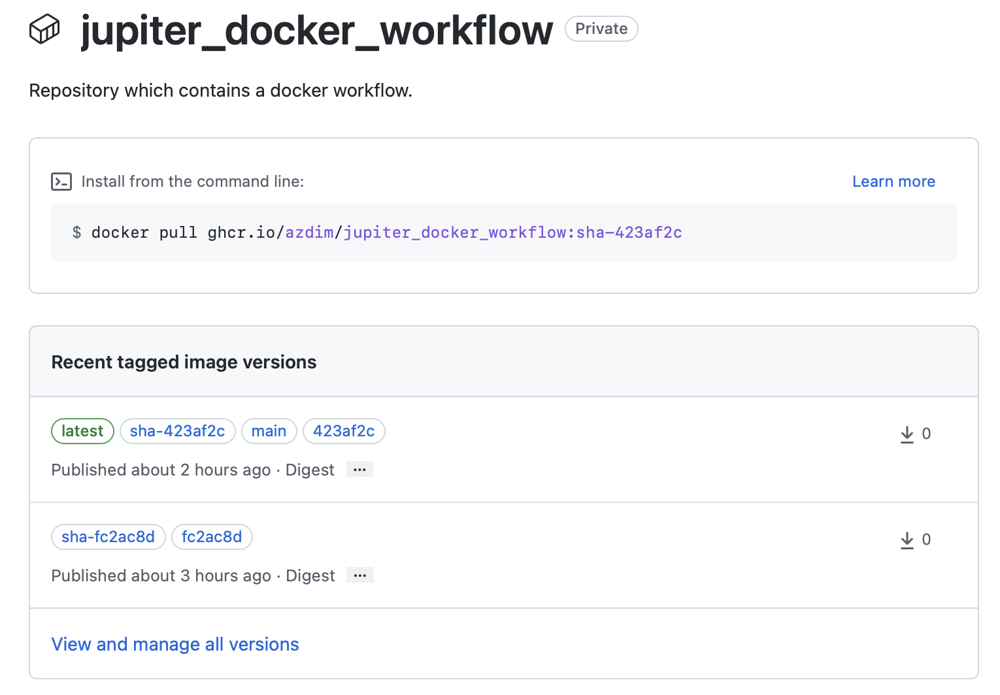
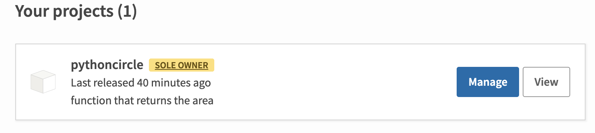

# Docker workflow with GitHub actions

* Repository for building and publishing a docker image to GitHub and Python package to PyPI.

* The code base is a reuse of my previous projects. The Python package is a built around a basic function to calculate perimeter and area of circle for an input of radius.

## Docker references

* [Best practices for Dockerfile](https://docs.docker.com/develop/develop-images/dockerfile_best-practices/)
* [Local deployment example](https://blog.atulr.com/docker-local-environment/)
* [Microsoft workflow example ](https://docs.microsoft.com/en-us/dotnet/architecture/microservices/docker-application-development-process/docker-app-development-workflow)

## Python package references

* [Publishing python package](https://packaging.python.org/en/latest/guides/publishing-package-distribution-releases-using-github-actions-ci-cd-workflows/)
