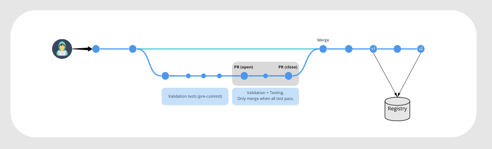

# scp-template-docker-image

[](https://github.com/az-scp/scp-template-docker-image/actions/workflows/main.yaml)
[](https://github.com/az-scp/scp-template-docker-image/actions/workflows/release.yaml)
[](https://github.com/az-scp/scp-template-docker-image/actions/workflows/pr.yaml)
[](https://github.com/az-scp/scp-template-docker-image/actions/workflows/tag.yaml)
[](https://github.com/az-scp/scp-template-docker-image/actions/workflows/pre-commit.yaml)
## Summary
This project is a Template for creating Docker image repositories. It provides an initial interface for common development tasks as a template in order to reduce the amount of time required to onboard new members. Additionally, allows to standardise common processes on the SCP team.


## Development Workflow
A common approach to develop container images follows these steps:

* Prepare and setup a development environment
* Iterate on the development worklow locally or in a specific environment (e.g. virtual machine)
* Create a Pull Request and Tag Changes to release the image.

### Prepare your environment
First, you need Docker Engine installed and running. Check if you can pull images from Docker Hub. If not, check  your proxy setup.

```bash
# Install precommit hooks
$ make setup
* Installing pipenv
pipenv install && pipenv sync
Installing dependencies from Pipfile.lock (6b52c0)...
[..]
All dependencies are now up-to-date!
$ pipenv shell
Launching subshell in virtual environment...
bash-5.1$  . /Users/kpbx917/.virtualenvs/scp_github_actions_tools-PVgixaua/bin/activate

# Run init to install pre-commit hooks
$ make init
* Preparing project
pre-commit install
pre-commit installed at .git/hooks/pre-commit
pre-commit autoupdate
Updating https://github.com/pre-commit/pre-commit-hooks ... already up to date.
Updating ssh://git@bitbucket.astrazeneca.net:7999/scp/pre-commit-hooks ... already up to date.
Updating https://git.iamthefij.com/iamthefij/docker-pre-commit.git ... already up to date.

# Login to GitHub registry
$ make login
* How to login to ghcr.io/az-ai ...
  $ export $CR_PAT=TOKEN
  $ echo $CR_PAT | docker login ghcr.io -u GH_HANDLE --password-stdin
* Running docker login to ghcr.io/az-ai ...
Authenticating with existing credentials...
Login Succeeded
```

### Local Development Workflow
```bash
# Define you tests following a TDD approach.
$ vim tests/test_app.py
$ git diff tests/test_app.py
-    assert res.get_data(as_text=True) == "MY_OUTPUT"
+    assert res.get_data(as_text=True) == "Hello World!"

# Make you changes
$ vim Dockerfile
$ git diff Dockerfile
diff --git a/Dockerfile b/Dockerfile
+    CMD ["app.py"

# Build locally and run test
$ make tests
* Building test image ...
docker build --target test  -t scp-template-docker-image:v0.2.0 .
[..]
=> naming to docker.io/library/scp-template-docker-image:v0.2.0
# Iterate until all your tests pass :)

# Build and run the image localy
$ make build run
$ make build run
* Building image ...
docker build --target prod -t scp-template-docker-image:v0.2.0 .
[+] Building 1.0s (9/9) FINISHED
* Run container
docker run -it --rm -p 5000:8000 scp-template-docker-image:v0.2.0
 * Serving Flask app 'app' (lazy loading)
 * Environment: production
   WARNING: This is a development server. Do not use it in a production deployment.
   Use a production WSGI server instead.
 * Debug mode: off
 * Running on http://127.0.0.1:5000/ (Press CTRL+C to quit)

# Do it again if this is not working :)
```

Optionally, you can manually push this image to the remote registry and set an special tag

```bash
# Build Image locally and push to remote registry applying the 'edge' tag
$ VERSION=edge make build push
```

### Release a new Version

### Version Management

On this project we follow a Semantic Versioning approach (http://semver.org/). It is a public specification for a versioning scheme, in the form of `[Major].[Minor].[Patch]`. The motivation for this scheme is to communicate meaning with the version number.

Following `make` rules present should provide a common interface around the version management process:

```bash
# Bump a patched version (e.g. 0.0.1 -> 0.0.2)
$ make release-patch

# Notice VERSION file is now updated and sync with the .bumpversion.cfg
$ head -n2 .bumpversion.cfg
[bumpversion]
current_version = 0.0.2
$ cat VERSION
v0.0.2

# Bump a patched version (e.g. 0.1.1 -> 0.2.0)
$ make release-minor

# Bump a major version (e.g. 0.0.1 -> 1.0.0)
$ make release

# push tags to trigger the release workflow.
$ make publish
```
## Continuous Integration Pipelines


Existing CI pipelines available are triggered at different points during the development process (see image above) and are defined as follows:

- **Main**: CI pipeline that runs once a PR is merged. File [`main.yml`](.github/workflows/main.yaml).
- **PR**: Pipeline triggered on every Pull Request. File [`pr.yml`](.github/workflows/pr.yaml).
- **Validate**: CI pipeline which runs pre-commit on every push. File [`pre-commit.yaml`](.github/workflows/pre-commit.yaml)

In contrast, with common `make` rules defined below, the remote CI/CD pipeline use common [GitHub Actions for Publishing Docker images](https://docs.github.com/en/actions/guides/publishing-docker-images).
